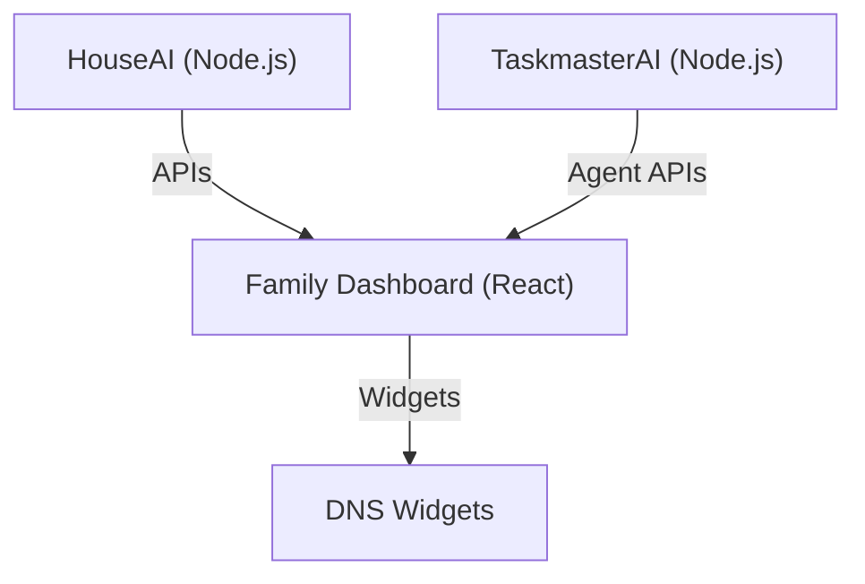

# Architecture Overview

This monorepo uses Turborepo to manage three main projects:

- **HouseAI**: Google integration and home server logic
- **Family Dashboard**: React UI and DNS widgets
- **TaskmasterAI**: Multi-agent coordination and agent registry

## Structure

- `apps/houseai` – Node.js backend for home automation
- `apps/family-dashboard` – React frontend for family dashboard
- `apps/taskmaster-ai` – Node.js backend for agent coordination
- `packages/` – Shared UI, config, and linting packages

## Communication

- Internal APIs between HouseAI and Family Dashboard
- TaskmasterAI exposes agent APIs/mnt/d/Projects/y  for coordination

## Development

- Managed with Turborepo for easy builds, tests, and dependency management