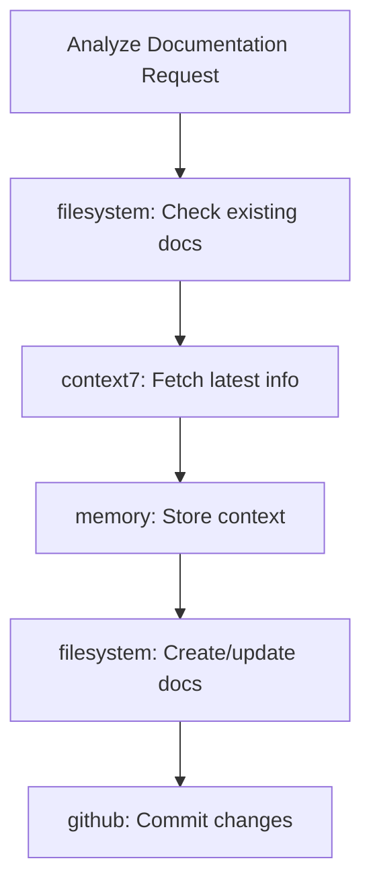
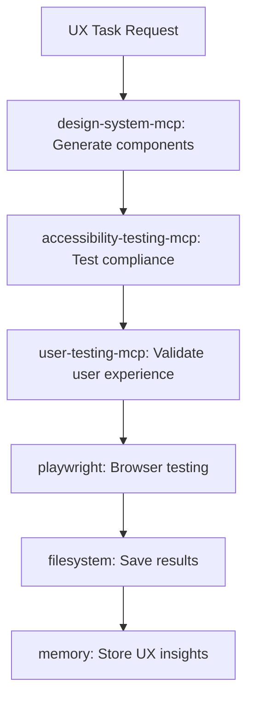
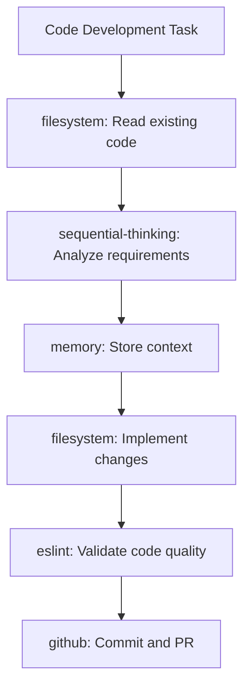
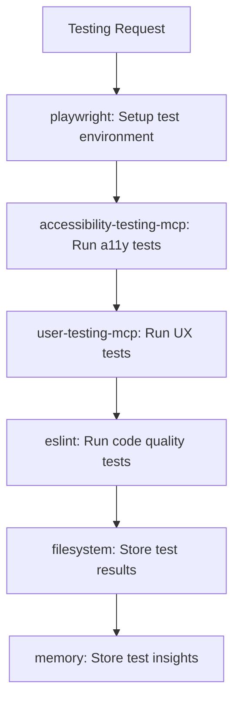
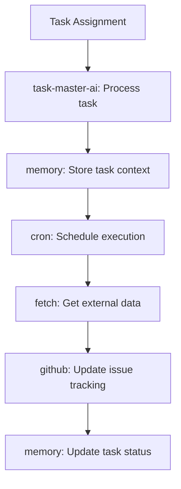

# MCP Agent Integration Guide

## Overview

This guide provides comprehensive patterns and best practices for agents to effectively utilize the Model Context Protocol (MCP) server ecosystem. It focuses on making agents aware of available capabilities and optimizing their integration workflows.

## Agent MCP Awareness Framework

### Understanding Your Context

Before utilizing any MCP servers, agents must understand their operational context:

```bash
# Check current project directory
pwd
# Determine available MCP servers based on location:
# /projects/claude-project = 17 servers (full development stack)
# /projects/claude-project/apps/taskmaster-ai = 8 servers (task-focused)
# /projects/crewai-studio/CrewAI-Studio = 7 servers (collaborative)
```

### MCP Server Discovery Pattern

```javascript
// Agent MCP awareness pattern
const mcpContext = {
  project: getCurrentProject(),
  availableServers: getAvailableMCPServers(),
  requiredCapabilities: analyzeTaskRequirements(),
  optimalStack: selectOptimalMCPStack()
};
```

## Agent-Specific Integration Patterns

### 1. Documentation Specialist Agent

**Core MCP Stack**:
- `filesystem` - Read/write documentation files
- `memory` - Maintain documentation context
- `context7` - Access latest documentation
- `github` - Version control for docs

**Integration Workflow**:


**Best Practices**:
- Use `context7` for real-time information before generating content
- Leverage `memory` to maintain consistency across documentation sessions
- Always use `filesystem` to check existing documentation structure
- Utilize `github` for version control and collaboration

**Example Implementation**:
```javascript
// Documentation agent MCP usage pattern
async function documentationWorkflow(topic) {
  // 1. Check existing documentation
  const existing = await filesystem.readFile(`docs/${topic}.md`);
  
  // 2. Get latest information
  const current = await context7.fetchDocumentation(topic);
  
  // 3. Store context for consistency
  await memory.store('documentation_context', { topic, existing, current });
  
  // 4. Generate enhanced documentation
  const enhanced = generateDocumentation({ existing, current });
  
  // 5. Save and version control
  await filesystem.writeFile(`docs/${topic}.md`, enhanced);
  await github.commit(`Update ${topic} documentation`);
}
```

### 2. UX/UI Specialist Agent

**Core MCP Stack**:
- `design-system-mcp` - Generate UI components and design tokens
- `accessibility-testing-mcp` - WCAG compliance validation
- `user-testing-mcp` - User journey and experience validation
- `playwright` - Browser automation for testing
- `tailwindcss` - Styling framework integration
- `shadcn-ui` - Component library access

**Integration Workflow**:


**Best Practices**:
- Always start with `design-system-mcp` for consistent UI patterns
- Follow up with `accessibility-testing-mcp` for compliance validation
- Use `user-testing-mcp` for comprehensive UX validation
- Leverage `playwright` for cross-browser compatibility testing
- Store UX insights in `memory` for future reference

**Example Implementation**:
```javascript
// UX agent comprehensive workflow
async function uxValidationWorkflow(pageUrl) {
  // 1. Generate design system components if needed
  const components = await designSystemMcp.generateComponent('widget', 'primary', 'medium');
  
  // 2. Test accessibility compliance
  const accessibilityScore = await accessibilityTestingMcp.testAccessibility(pageUrl);
  
  // 3. Validate user experience
  const uxScore = await userTestingMcp.validateUserExperience(pageUrl, 'new-user');
  
  // 4. Store comprehensive results
  await memory.store('ux_validation', {
    url: pageUrl,
    accessibility: accessibilityScore,
    userExperience: uxScore,
    components: components,
    timestamp: new Date()
  });
  
  return { accessibilityScore, uxScore, recommendations: generateRecommendations() };
}
```

### 3. Code Development Agent

**Core MCP Stack**:
- `filesystem` - File operations
- `memory` - Code context management
- `sequential-thinking` - Complex problem solving
- `eslint` - Code quality enforcement
- `github` - Version control operations

**Integration Workflow**:


**Best Practices**:
- Use `sequential-thinking` for complex algorithm design
- Always validate with `eslint` before committing
- Maintain code context with `memory` across sessions
- Use `github` for collaboration and code review

**Example Implementation**:
```javascript
// Code development agent workflow
async function codeImplementationWorkflow(feature) {
  // 1. Analyze existing codebase
  const existingCode = await filesystem.readDirectory('./src');
  
  // 2. Use sequential thinking for complex features
  const implementationPlan = await sequentialThinking.analyze(feature);
  
  // 3. Store development context
  await memory.store('development_context', {
    feature,
    plan: implementationPlan,
    existingStructure: existingCode
  });
  
  // 4. Implement feature
  const newCode = implementFeature(feature, implementationPlan);
  await filesystem.writeFile(`./src/${feature}.js`, newCode);
  
  // 5. Validate code quality
  const lintResults = await eslint.lintFile(`./src/${feature}.js`);
  
  // 6. Commit if quality passes
  if (lintResults.errorCount === 0) {
    await github.commit(`Implement ${feature} feature`);
  }
}
```

### 4. Testing Specialist Agent

**Core MCP Stack**:
- `playwright` - Browser automation
- `accessibility-testing-mcp` - WCAG compliance
- `user-testing-mcp` - User journey validation
- `eslint` - Code quality testing
- `filesystem` - Test result storage

**Integration Workflow**:


**Best Practices**:
- Run accessibility tests before UX tests
- Use comprehensive test scenarios across different user types
- Store detailed test results for trend analysis
- Combine multiple testing approaches for complete coverage

### 5. Task Management Agent

**Core MCP Stack**:
- `task-master-ai` - Core task coordination
- `memory` - Task state management
- `cron` - Scheduled task execution
- `fetch` - External API integration
- `github` - Repository task tracking

**Integration Workflow**:


**Best Practices**:
- Always use `memory` to track task state across sessions
- Leverage `cron` for recurring tasks and reminders
- Integrate with `github` for issue tracking and project management
- Use `fetch` for external API coordination

## Cross-Agent Collaboration Patterns

### Multi-Agent MCP Coordination

When multiple agents work together, MCP server coordination becomes critical:

```javascript
// Multi-agent coordination pattern
const agentCoordination = {
  // Shared servers for collaboration
  shared: ['filesystem', 'memory', 'github'],
  
  // Agent-specific servers
  documentation: ['context7'],
  ux: ['design-system-mcp', 'accessibility-testing-mcp', 'user-testing-mcp'],
  development: ['eslint', 'sequential-thinking'],
  testing: ['playwright'],
  management: ['task-master-ai', 'cron']
};
```

### Conflict Resolution

When multiple agents need the same resources:
1. **File locking**: Use `memory` to coordinate file access
2. **Task queuing**: Use `task-master-ai` for task prioritization  
3. **Resource pooling**: Share expensive servers like `playwright`

## Environment-Specific Patterns

### Main Project Environment (17 Servers)
**Use Case**: Full development lifecycle
**Pattern**: Utilize complete MCP ecosystem for comprehensive development
**Agents**: All agent types can operate with full capability

### TaskMaster AI Environment (8 Servers)  
**Use Case**: Task-focused operations with UX validation
**Pattern**: Focus on task management with UX testing capabilities
**Agents**: Task management, UX specialists, limited development

### CrewAI Studio Environment (7 Servers)
**Use Case**: Collaborative multi-agent development
**Pattern**: Emphasis on coordination and code quality
**Agents**: Documentation, development, testing coordination

## Common Integration Patterns

### 1. Progressive Enhancement Pattern
```javascript
// Start with core servers, add specialized servers as needed
const baseStack = ['filesystem', 'memory'];
const enhancedStack = [...baseStack, 'sequential-thinking'];
const specializedStack = [...enhancedStack, 'design-system-mcp'];
```

### 2. Fallback Pattern
```javascript
// Graceful degradation when servers unavailable
async function robustMcpCall(primary, fallback, operation) {
  try {
    return await primary[operation]();
  } catch (error) {
    console.warn(`Primary MCP failed, using fallback: ${error.message}`);
    return await fallback[operation]();
  }
}
```

### 3. Batching Pattern
```javascript
// Batch multiple MCP calls for efficiency
async function batchMcpOperations(operations) {
  const results = await Promise.allSettled(
    operations.map(op => op.server[op.method](...op.args))
  );
  return results.map(result => result.status === 'fulfilled' ? result.value : null);
}
```

## Performance Optimization

### Server Selection Strategy
1. **Identify minimum viable stack** for the task
2. **Avoid redundant servers** (e.g., playwright + puppeteer)
3. **Prioritize lightweight servers** for simple tasks
4. **Use heavyweight servers** only when necessary

### Resource Management
```javascript
// Resource-aware MCP usage
const resourceUsage = {
  light: ['filesystem', 'memory', 'eslint', 'fetch'],
  medium: ['github', 'task-master-ai', 'sequential-thinking'],
  heavy: ['playwright', 'puppeteer', 'docker']
};

// Select servers based on available resources
function selectMcpStack(taskComplexity, availableResources) {
  if (availableResources === 'limited') {
    return resourceUsage.light;
  }
  return taskComplexity === 'simple' 
    ? [...resourceUsage.light, ...resourceUsage.medium.slice(0, 2)]
    : [...resourceUsage.light, ...resourceUsage.medium, ...resourceUsage.heavy.slice(0, 1)];
}
```

## Error Handling and Resilience

### MCP Server Health Checking
```javascript
// Health check pattern for MCP servers
async function healthCheckMcp(serverName) {
  try {
    const response = await mcpServers[serverName].ping();
    return { server: serverName, status: 'healthy', response };
  } catch (error) {
    return { server: serverName, status: 'unhealthy', error: error.message };
  }
}
```

### Graceful Degradation
```javascript
// Graceful degradation when MCP servers fail
async function resilientOperation(primaryMcp, fallbackMethod, operation) {
  try {
    return await primaryMcp[operation]();
  } catch (error) {
    console.warn(`MCP server unavailable, using fallback: ${error.message}`);
    return await fallbackMethod();
  }
}
```

## Security and Best Practices

### API Key Management
- Never expose API keys in logs or error messages
- Use environment variables for all sensitive configuration
- Rotate API keys regularly
- Monitor API usage for unusual patterns

### Access Control
```javascript
// MCP access control pattern
const agentPermissions = {
  'documentation-agent': ['filesystem', 'memory', 'context7', 'github'],
  'ux-agent': ['design-system-mcp', 'accessibility-testing-mcp', 'user-testing-mcp', 'playwright'],
  'code-agent': ['filesystem', 'memory', 'sequential-thinking', 'eslint', 'github']
};

function validateMcpAccess(agentType, requestedServer) {
  return agentPermissions[agentType]?.includes(requestedServer) || false;
}
```

### Rate Limiting
```javascript
// Rate limiting pattern for external MCP servers
const rateLimiter = new Map();

async function rateLimitedMcpCall(server, method, ...args) {
  const key = `${server}-${method}`;
  const lastCall = rateLimiter.get(key);
  const minInterval = 1000; // 1 second between calls
  
  if (lastCall && Date.now() - lastCall < minInterval) {
    await new Promise(resolve => setTimeout(resolve, minInterval));
  }
  
  rateLimiter.set(key, Date.now());
  return await mcpServers[server][method](...args);
}
```

## Troubleshooting Guide

### Common Issues and Solutions

| Issue | Symptoms | Solution |
|-------|----------|----------|
| Server not found | `MCP server not available` | Check `.mcp.json` configuration and project directory |
| API authentication failed | `401 Unauthorized` | Verify API keys in `.env` file |
| Browser automation fails | Playwright/Puppeteer errors | Check headless browser support in WSL/Linux |
| Path resolution errors | File not found errors | Ensure correct working directory for relative paths |
| Memory overflow | High RAM usage | Limit concurrent heavy servers (playwright, puppeteer) |
| Rate limit exceeded | `429 Too Many Requests` | Implement rate limiting and backoff strategies |

### Debugging MCP Integration

```javascript
// Debug logging for MCP operations
function debugMcpCall(server, method, args) {
  console.log(`[MCP DEBUG] ${server}.${method}(${JSON.stringify(args)})`);
  const startTime = Date.now();
  
  return mcpServers[server][method](...args)
    .then(result => {
      console.log(`[MCP DEBUG] ${server}.${method} completed in ${Date.now() - startTime}ms`);
      return result;
    })
    .catch(error => {
      console.error(`[MCP ERROR] ${server}.${method} failed:`, error.message);
      throw error;
    });
}
```

## Advanced Integration Patterns

### Dynamic MCP Stack Selection
```javascript
// Intelligent MCP stack selection based on task analysis
function analyzeMcpNeeds(task) {
  const needs = {
    fileOperations: task.includes('file') || task.includes('read') || task.includes('write'),
    codeQuality: task.includes('lint') || task.includes('quality') || task.includes('standard'),
    uiTesting: task.includes('ui') || task.includes('accessibility') || task.includes('user'),
    versionControl: task.includes('git') || task.includes('commit') || task.includes('pr'),
    taskManagement: task.includes('task') || task.includes('schedule') || task.includes('manage'),
    browserTesting: task.includes('browser') || task.includes('test') || task.includes('automation')
  };
  
  const requiredServers = [];
  if (needs.fileOperations) requiredServers.push('filesystem', 'memory');
  if (needs.codeQuality) requiredServers.push('eslint');
  if (needs.uiTesting) requiredServers.push('accessibility-testing-mcp', 'user-testing-mcp');
  if (needs.versionControl) requiredServers.push('github');
  if (needs.taskManagement) requiredServers.push('task-master-ai');
  if (needs.browserTesting) requiredServers.push('playwright');
  
  return [...new Set(requiredServers)]; // Remove duplicates
}
```

### MCP Pipeline Pattern
```javascript
// Chain MCP operations for complex workflows
class McpPipeline {
  constructor() {
    this.steps = [];
  }
  
  addStep(server, method, args = []) {
    this.steps.push({ server, method, args });
    return this;
  }
  
  async execute() {
    const results = [];
    for (const step of this.steps) {
      const result = await mcpServers[step.server][step.method](...step.args);
      results.push(result);
    }
    return results;
  }
}

// Usage example
const uxValidationPipeline = new McpPipeline()
  .addStep('design-system-mcp', 'generateComponent', ['button', 'primary', 'medium'])
  .addStep('accessibility-testing-mcp', 'testAccessibility', ['http://localhost:8000'])
  .addStep('user-testing-mcp', 'validateUserExperience', ['http://localhost:8000', 'new-user'])
  .addStep('memory', 'store', ['ux-validation-results', 'pipeline-results']);
```

This integration guide serves as the primary reference for agents to effectively utilize the MCP ecosystem while maintaining performance, security, and reliability standards.