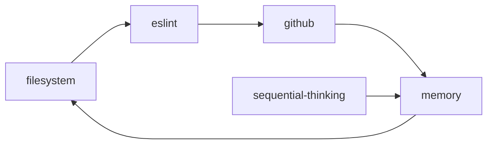
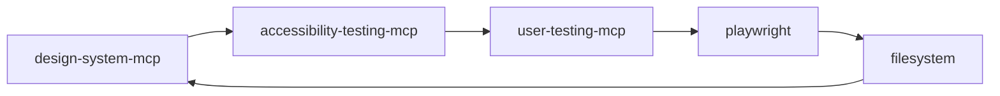
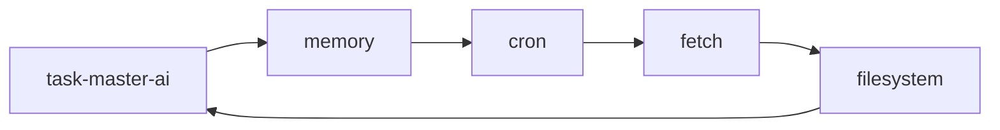

# MCP Server Capability Matrix

## Overview

This document provides a comprehensive mapping of all MCP servers available across the claude-project ecosystem, their capabilities, and integration patterns for effective agent utilization.

## Server Inventory by Project

### Main Project (17 Servers)
| Server | Type | Required API Keys | Primary Use Case |
|--------|------|------------------|------------------|
| task-master-ai | Integration | GOOGLE_API_KEY | AI task coordination and management |
| filesystem | Core | None | File system read/write operations |
| memory | Core | None | Context memory and state management |
| sequential-thinking | Core | None | Sequential reasoning support |
| github | Integration | GITHUB_TOKEN | Git repository operations |
| context7 | Documentation | None | Up-to-date documentation fetching |
| vite | Build | None | Build tool integration |
| tailwindcss | Styling | None | CSS framework integration |
| shadcn-ui | UI Components | None | Component library access |
| cron | Scheduling | None | Task scheduling and automation |
| fetch | Network | None | HTTP requests and API calls |
| playwright | Testing | None | Browser automation and testing |
| docker | Containers | None | Container management |
| eslint | Code Quality | None | JavaScript/TypeScript linting |
| accessibility-testing-mcp | Custom UX | None | WCAG compliance testing |
| user-testing-mcp | Custom UX | None | User journey validation |
| design-system-mcp | Custom UX | None | UI consistency and design tokens |

### TaskMaster AI (8 Servers)
| Server | Type | Difference from Main | Purpose in TaskMaster |
|--------|------|---------------------|---------------------|
| task-master-ai | Integration | Same | Core task management |
| filesystem | Core | Same | File operations |
| memory | Core | Same | State persistence |
| puppeteer | Testing | Additional (not in main) | Browser automation |
| playwright | Testing | Same | Cross-browser testing |
| accessibility-testing-mcp | Custom UX | Same | UX validation |
| user-testing-mcp | Custom UX | Same | User journey testing |
| design-system-mcp | Custom UX | Same | Design consistency |

### CrewAI Studio (7 Servers)
| Server | Type | Focus Area | Collaborative Use |
|--------|------|------------|-------------------|
| filesystem | Core | File management | Shared file access |
| memory | Core | State management | Shared context |
| sequential-thinking | Core | Reasoning | Multi-agent coordination |
| github | Integration | Version control | Collaborative development |
| eslint | Code Quality | Code standards | Team code consistency |
| playwright | Testing | Testing | Automated validation |
| context7 | Documentation | Knowledge access | Shared documentation |

## Detailed Capability Analysis

### Core Infrastructure Servers

#### filesystem
**Capabilities**: File read/write, directory operations, path resolution
**Agent Integration**: Essential for any file-based operations
**Use Cases**: Code editing, config management, log reading
**Performance**: High - direct filesystem access
**Limitations**: No git operations, no remote file access

#### memory
**Capabilities**: Context storage, session persistence, state management
**Agent Integration**: Critical for maintaining conversation context
**Use Cases**: Remember user preferences, maintain task state, cross-session continuity
**Performance**: High - in-memory operations
**Limitations**: Session-scoped, no permanent storage

#### sequential-thinking
**Capabilities**: Multi-step reasoning, thought chain management
**Agent Integration**: Enhances complex problem-solving capabilities
**Use Cases**: Complex task breakdown, multi-step analysis, decision trees
**Performance**: Medium - depends on reasoning complexity
**Limitations**: Computational overhead for complex chains

### Integration Servers

#### task-master-ai
**Capabilities**: AI task coordination, Google API integration
**Agent Integration**: Central task management hub
**Use Cases**: Task assignment, progress tracking, AI coordination
**Performance**: Medium - depends on Google API response
**Limitations**: Requires GOOGLE_API_KEY, rate limits apply

#### github
**Capabilities**: Repository operations, issue management, PR creation
**Agent Integration**: Essential for code collaboration
**Use Cases**: Code commits, issue tracking, repository analysis
**Performance**: Medium - depends on GitHub API limits
**Limitations**: Requires GITHUB_TOKEN, API rate limits

#### context7
**Capabilities**: Real-time documentation fetching, knowledge updates
**Agent Integration**: Provides current information beyond training data
**Use Cases**: Latest documentation, API changes, current best practices
**Performance**: Medium - depends on network and target sites
**Limitations**: Limited to publicly accessible documentation

### Development & Testing Servers

#### playwright
**Capabilities**: Cross-browser testing, page automation, screenshot capture
**Agent Integration**: Essential for web application testing
**Use Cases**: UI testing, regression testing, user journey validation
**Performance**: Medium - browser startup overhead
**Limitations**: Requires headless browser support

#### puppeteer
**Capabilities**: Chrome-specific automation, PDF generation, performance testing
**Agent Integration**: Specialized browser automation
**Use Cases**: Chrome-specific testing, PDF reports, performance metrics
**Performance**: Medium - Chrome startup overhead
**Limitations**: Chrome-only, resource intensive

#### eslint
**Capabilities**: JavaScript/TypeScript linting, code quality analysis
**Agent Integration**: Automated code quality enforcement
**Use Cases**: Code review, style enforcement, error detection
**Performance**: High - fast static analysis
**Limitations**: JavaScript/TypeScript only

### Custom UX Servers

#### accessibility-testing-mcp
**Capabilities**: WCAG compliance testing, keyboard navigation, color contrast
**Agent Integration**: Automated accessibility validation
**Use Cases**: Accessibility audits, compliance checking, UX improvement
**Performance**: Medium - browser-based testing
**Test Coverage**: 100/100 dashboard score achieved
**Tools Available**: test_accessibility, check_keyboard_navigation, validate_color_contrast

#### user-testing-mcp
**Capabilities**: User journey testing, task flow validation, UX scoring
**Agent Integration**: Comprehensive user experience validation
**Use Cases**: Task completion testing, navigation efficiency, user feedback quality
**Performance**: Medium - browser automation required
**Test Coverage**: 100/100 UX validation score
**Tools Available**: test_task_assignment_journey, test_dashboard_navigation, test_user_feedback_flow, validate_user_experience

#### design-system-mcp
**Capabilities**: UI component generation, design consistency validation, design tokens
**Agent Integration**: Automated design system management
**Use Cases**: Component creation, design validation, token generation
**Performance**: High - template-based generation
**Test Coverage**: 95/100 design consistency score
**Tools Available**: generate_component, validate_design_consistency, generate_design_tokens, create_component_library

### Build & Styling Servers

#### vite
**Capabilities**: Fast build tool integration, HMR support
**Agent Integration**: Development workflow automation
**Use Cases**: Build process management, development server
**Performance**: High - optimized for speed
**Limitations**: Modern framework focus

#### tailwindcss
**Capabilities**: Utility-first CSS framework integration
**Agent Integration**: Rapid styling implementation
**Use Cases**: Responsive design, utility class generation
**Performance**: High - build-time CSS generation
**Limitations**: Learning curve for utility-first approach

#### shadcn-ui
**Capabilities**: Modern UI component library access
**Agent Integration**: Pre-built component integration
**Use Cases**: Rapid UI development, consistent components
**Performance**: High - pre-built components
**Limitations**: React-focused ecosystem

### Utility Servers

#### cron
**Capabilities**: Task scheduling, automation workflows
**Agent Integration**: Automated task execution
**Use Cases**: Periodic tasks, maintenance automation, monitoring
**Performance**: High - system-level scheduling
**Limitations**: System-dependent

#### fetch
**Capabilities**: HTTP requests, API integration, web scraping
**Agent Integration**: External data access
**Use Cases**: API calls, data fetching, web content retrieval
**Performance**: Medium - network dependent
**Limitations**: CORS restrictions, rate limits

#### docker
**Capabilities**: Container management, image operations
**Agent Integration**: Containerized service management
**Use Cases**: Service deployment, environment isolation
**Performance**: Medium - container startup overhead
**Limitations**: Docker daemon required

## Integration Patterns by Use Case

### Code Development Workflow

**Primary Stack**: filesystem, memory, sequential-thinking, eslint, github
**Optional**: context7 (documentation), docker (containerization)

### UX/UI Development Workflow

**Primary Stack**: design-system-mcp, accessibility-testing-mcp, user-testing-mcp, playwright
**Supporting**: filesystem, memory, tailwindcss, shadcn-ui

### Task Management Workflow

**Primary Stack**: task-master-ai, memory, cron
**Supporting**: filesystem, fetch, github

## Server Compatibility Matrix

### Cross-Server Dependencies
| Server | Depends On | Conflicts With | Complements |
|--------|------------|----------------|-------------|
| accessibility-testing-mcp | playwright/puppeteer | None | user-testing-mcp, design-system-mcp |
| user-testing-mcp | playwright/puppeteer | None | accessibility-testing-mcp, design-system-mcp |
| design-system-mcp | None | None | tailwindcss, shadcn-ui |
| github | filesystem | None | memory, sequential-thinking |
| task-master-ai | memory | None | cron, fetch |

### Resource Usage Considerations
| Server | CPU Usage | Memory Usage | Network Usage | Storage Usage |
|--------|-----------|--------------|---------------|---------------|
| playwright | High | High | Medium | Low |
| puppeteer | High | High | Medium | Low |
| docker | Medium | High | Low | High |
| vite | Medium | Medium | Low | Low |
| All others | Low | Low | Variable | Low |

## Agent-Specific MCP Recommendations

### Documentation Agent
**Essential**: filesystem, memory, context7, github
**Useful**: sequential-thinking, fetch
**Avoid**: Heavy testing servers (playwright, puppeteer)

### Testing Agent
**Essential**: accessibility-testing-mcp, user-testing-mcp, playwright
**Useful**: design-system-mcp, memory, filesystem
**Avoid**: Build tools unless testing build process

### UI/UX Agent
**Essential**: design-system-mcp, accessibility-testing-mcp, user-testing-mcp
**Useful**: tailwindcss, shadcn-ui, playwright, filesystem, memory
**Avoid**: Backend-focused servers (docker, cron)

### Backend Agent
**Essential**: filesystem, memory, github, docker
**Useful**: cron, fetch, eslint, sequential-thinking
**Avoid**: UI-specific servers (tailwindcss, shadcn-ui)

### Project Manager Agent
**Essential**: task-master-ai, memory, github, cron
**Useful**: filesystem, fetch, context7
**Avoid**: Low-level development servers

## Performance Optimization Guidelines

### Server Startup Order
1. **Core servers first**: filesystem, memory
2. **Integration servers**: github, task-master-ai (if needed)
3. **Development servers**: eslint, vite (if developing)
4. **Testing servers**: playwright, puppeteer (if testing)
5. **Custom servers**: accessibility-testing-mcp, user-testing-mcp, design-system-mcp

### Resource Management
- **Limit concurrent browser servers**: Only run playwright OR puppeteer, not both simultaneously
- **Memory monitoring**: Monitor memory usage when using multiple custom UX servers
- **Network consideration**: Rate limit awareness for github and task-master-ai

### Troubleshooting Common Issues
| Issue | Likely Cause | Solution |
|-------|--------------|----------|
| Server not starting | Missing dependencies | Run `npm install` in project root |
| API authentication failed | Missing/invalid API keys | Check `.env` file configuration |
| Browser automation fails | Headless browser issues | Check WSL/Linux browser support |
| Custom server path errors | Wrong working directory | Ensure correct project directory |
| Rate limit exceeded | Too many API calls | Implement request throttling |

## Future Expansion Guidelines

### Adding New Servers
1. Update `.mcp.json` configuration
2. Add to this capability matrix
3. Update integration patterns
4. Test with existing server combinations
5. Update agent-specific recommendations

### Server Deprecation Process
1. Mark as deprecated in documentation
2. Update agent recommendations
3. Provide migration path
4. Remove from configurations
5. Clean up documentation references

This capability matrix serves as the definitive reference for understanding and utilizing the MCP server ecosystem across all project contexts.