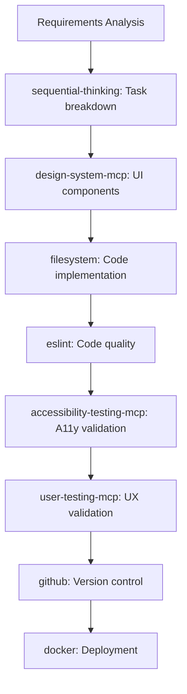
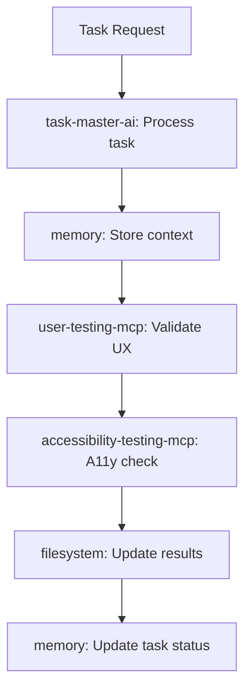
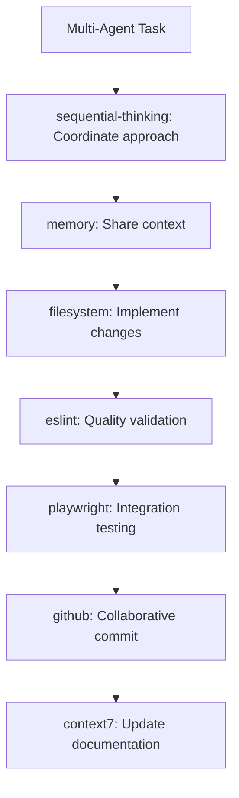

# MCP Project Integration Guide

## Overview

This guide provides project-specific MCP integration patterns and configurations for effective agent coordination across different development contexts within the claude-project ecosystem.

## Project-Specific MCP Configurations

### Main Project Context: `/projects/claude-project/`

**Environment**: Full Development Stack (17 Servers)  
**Primary Use Case**: Comprehensive development with complete tooling ecosystem  
**Agent Types**: All agent types with full capabilities

#### Available MCP Servers
```json
{
  "core_infrastructure": ["filesystem", "memory", "sequential-thinking"],
  "integration_services": ["task-master-ai", "github", "context7"],
  "development_tools": ["vite", "tailwindcss", "shadcn-ui", "cron", "fetch", "playwright", "docker", "eslint"],
  "custom_ux_servers": ["accessibility-testing-mcp", "user-testing-mcp", "design-system-mcp"]
}
```

#### Agent Integration Patterns

**Documentation Agent Stack**:
```javascript
const documentationAgentMcp = {
  essential: ["filesystem", "memory", "context7"],
  useful: ["github", "sequential-thinking"],
  specialized: ["fetch"] // for external documentation
};
```

**UX/UI Agent Stack**:
```javascript
const uxAgentMcp = {
  essential: ["design-system-mcp", "accessibility-testing-mcp", "user-testing-mcp"],
  supporting: ["playwright", "tailwindcss", "shadcn-ui"],
  infrastructure: ["filesystem", "memory"]
};
```

**Development Agent Stack**:
```javascript
const developmentAgentMcp = {
  essential: ["filesystem", "memory", "sequential-thinking", "eslint"],
  version_control: ["github"],
  build_tools: ["vite", "docker"],
  optional: ["context7", "fetch"]
};
```

#### Project-Specific Workflows

**Full Development Lifecycle**:


### TaskMaster AI Context: `/projects/claude-project/apps/taskmaster-ai/`

**Environment**: Task-Focused Development (8 Servers)  
**Primary Use Case**: Task management with UX validation focus  
**Agent Types**: Task management, UX specialists, limited development

#### Available MCP Servers
```json
{
  "core_infrastructure": ["filesystem", "memory"],
  "task_management": ["task-master-ai"],
  "browser_testing": ["puppeteer", "playwright"],
  "custom_ux_servers": ["accessibility-testing-mcp", "user-testing-mcp", "design-system-mcp"]
}
```

#### Agent Integration Patterns

**Task Management Agent Stack**:
```javascript
const taskManagementMcp = {
  essential: ["task-master-ai", "memory"],
  file_operations: ["filesystem"],
  validation: ["user-testing-mcp"],
  optional: ["accessibility-testing-mcp"]
};
```

**UX Validation Agent Stack**:
```javascript
const uxValidationMcp = {
  essential: ["accessibility-testing-mcp", "user-testing-mcp", "design-system-mcp"],
  testing: ["playwright", "puppeteer"], // Note: Both available here
  infrastructure: ["filesystem", "memory"]
};
```

#### TaskMaster-Specific Workflows

**Task Assignment and Validation**:


**Key Differences from Main Project**:
- No sequential-thinking server (simpler reasoning)
- No github integration (focused on task execution)
- No build tools (not doing development builds)
- Both puppeteer AND playwright available (comprehensive testing)

### CrewAI Studio Context: `/projects/crewai-studio/CrewAI-Studio/`

**Environment**: Collaborative AI Development (7 Servers)  
**Primary Use Case**: Multi-agent collaborative development  
**Agent Types**: Documentation, development, collaborative coordination

#### Available MCP Servers
```json
{
  "core_infrastructure": ["filesystem", "memory", "sequential-thinking"],
  "collaboration": ["github", "eslint"],
  "testing": ["playwright"],
  "documentation": ["context7"]
}
```

#### Agent Integration Patterns

**Collaborative Development Agent Stack**:
```javascript
const collaborativeDevelopmentMcp = {
  essential: ["filesystem", "memory", "sequential-thinking"],
  collaboration: ["github", "eslint"],
  testing: ["playwright"],
  documentation: ["context7"]
};
```

**Multi-Agent Coordination**:
```javascript
const multiAgentCoordination = {
  shared_context: ["memory", "filesystem"],
  version_control: ["github"],
  code_quality: ["eslint"],
  reasoning: ["sequential-thinking"],
  knowledge: ["context7"]
};
```

#### CrewAI-Specific Workflows

**Collaborative Development Process**:


**Key Characteristics**:
- Focus on multi-agent coordination
- Strong emphasis on code quality (eslint)
- Documentation-heavy (context7)
- No custom UX servers (different focus)
- Testing via playwright only

## Cross-Project MCP Coordination

### Agent Context Switching

When agents work across multiple project contexts, they must adapt their MCP usage:

```javascript
// Context-aware MCP selection
function selectMcpStack(projectContext, agentType, taskType) {
  const availableServers = getProjectMcpServers(projectContext);
  const agentRequirements = getAgentMcpRequirements(agentType);
  const taskSpecificNeeds = getTaskMcpNeeds(taskType);
  
  return optimizeMcpStack(availableServers, agentRequirements, taskSpecificNeeds);
}

// Project context detection
function detectProjectContext() {
  const cwd = process.cwd();
  if (cwd.includes('/apps/taskmaster-ai')) return 'taskmaster';
  if (cwd.includes('/crewai-studio/CrewAI-Studio')) return 'crewai';
  if (cwd.includes('/projects/claude-project')) return 'main';
  return 'unknown';
}
```

### Resource Sharing Patterns

#### Shared Infrastructure Servers
All projects share these core servers with consistent behavior:
- **filesystem**: File operations across all projects
- **memory**: Context management (project-scoped)

#### Project-Specific Optimizations
- **Main Project**: Full tooling for comprehensive development
- **TaskMaster**: Task-focused with comprehensive UX testing
- **CrewAI**: Collaboration-optimized with reasoning emphasis

### Migration Patterns

When moving work between projects:

```javascript
// Project migration checklist
const migrationChecklist = {
  verify_context: () => checkCurrentProjectDirectory(),
  assess_available_mcps: () => listAvailableMcpServers(),
  adapt_agent_stack: () => selectOptimalMcpConfiguration(),
  validate_functionality: () => testMcpServerConnectivity(),
  update_workflows: () => adaptWorkflowsToAvailableServers()
};
```

## Agent-Specific Project Recommendations

### Documentation Agents

**Main Project**: Full documentation capabilities with context7 and github integration
```javascript
const mainProjectDocAgent = {
  servers: ["filesystem", "memory", "context7", "github"],
  capabilities: ["comprehensive_docs", "version_control", "real_time_updates"],
  workflows: ["research", "write", "validate", "commit"]
};
```

**TaskMaster**: Limited to task-specific documentation
```javascript
const taskmasterDocAgent = {
  servers: ["filesystem", "memory"],
  capabilities: ["task_documentation", "local_storage"],
  workflows: ["document_tasks", "update_status"]
};
```

**CrewAI**: Collaborative documentation with external knowledge
```javascript
const crewaiDocAgent = {
  servers: ["filesystem", "memory", "context7", "github"],
  capabilities: ["collaborative_docs", "external_knowledge", "team_coordination"],
  workflows: ["research", "collaborate", "document", "share"]
};
```

### UX Agents

**Main Project**: Complete UX validation ecosystem
```javascript
const mainProjectUxAgent = {
  servers: ["accessibility-testing-mcp", "user-testing-mcp", "design-system-mcp", "playwright"],
  capabilities: ["full_ux_validation", "design_system_management", "comprehensive_testing"],
  workflows: ["design", "implement", "test_accessibility", "test_ux", "validate"]
};
```

**TaskMaster**: UX validation focused on task flows
```javascript
const taskmasterUxAgent = {
  servers: ["accessibility-testing-mcp", "user-testing-mcp", "design-system-mcp", "playwright", "puppeteer"],
  capabilities: ["task_flow_validation", "accessibility_compliance", "dual_browser_testing"],
  workflows: ["validate_task_flows", "test_accessibility", "optimize_ux"]
};
```

**CrewAI**: No dedicated UX servers (use playwright for basic testing)
```javascript
const crewaiUxAgent = {
  servers: ["playwright"],
  capabilities: ["basic_browser_testing", "integration_validation"],
  workflows: ["test_integration", "validate_workflows"]
};
```

### Development Agents

**Main Project**: Full development lifecycle support
```javascript
const mainProjectDevAgent = {
  servers: ["filesystem", "memory", "sequential-thinking", "eslint", "github", "vite", "docker"],
  capabilities: ["full_development", "build_tools", "containerization", "version_control"],
  workflows: ["analyze", "implement", "build", "test", "deploy", "commit"]
};
```

**TaskMaster**: Task-focused development with file operations
```javascript
const taskmasterDevAgent = {
  servers: ["filesystem", "memory", "task-master-ai"],
  capabilities: ["task_implementation", "basic_file_operations"],
  workflows: ["implement_task", "update_files", "coordinate_with_taskmaster"]
};
```

**CrewAI**: Collaborative development with quality focus
```javascript
const crewaiDevAgent = {
  servers: ["filesystem", "memory", "sequential-thinking", "eslint", "github"],
  capabilities: ["collaborative_development", "code_quality", "team_coordination"],
  workflows: ["analyze", "collaborate", "implement", "validate_quality", "commit"]
};
```

## Integration Best Practices

### 1. Context Awareness
Always detect and adapt to the current project context:
```javascript
// Best practice: Context-aware initialization
async function initializeAgent() {
  const context = detectProjectContext();
  const availableServers = await getAvailableMcpServers(context);
  const agentConfig = adaptConfigToContext(context, availableServers);
  return initializeWithConfig(agentConfig);
}
```

### 2. Graceful Degradation
Handle missing servers gracefully:
```javascript
// Best practice: Fallback mechanisms
async function robustMcpOperation(preferredServer, fallbackServer, operation) {
  try {
    return await mcpServers[preferredServer][operation]();
  } catch (error) {
    if (fallbackServer && mcpServers[fallbackServer]) {
      console.warn(`Falling back to ${fallbackServer} for ${operation}`);
      return await mcpServers[fallbackServer][operation]();
    }
    throw new Error(`Neither ${preferredServer} nor ${fallbackServer} available for ${operation}`);
  }
}
```

### 3. Resource Optimization
Optimize MCP usage based on project resources:
```javascript
// Best practice: Resource-aware server selection
function selectOptimalServers(projectContext, taskComplexity) {
  const availableServers = getProjectServers(projectContext);
  const resourceIntensive = ['playwright', 'puppeteer', 'docker'];
  
  if (taskComplexity === 'simple' && availableServers.length > 10) {
    // Use lightweight servers for simple tasks in resource-rich environments
    return availableServers.filter(server => !resourceIntensive.includes(server));
  }
  
  return availableServers; // Use all available for complex tasks
}
```

### 4. Workflow Adaptation
Adapt workflows to available capabilities:
```javascript
// Best practice: Workflow adaptation
function adaptWorkflowToProject(standardWorkflow, projectContext) {
  const availableServers = getProjectServers(projectContext);
  
  return standardWorkflow
    .filter(step => availableServers.includes(step.server))
    .map(step => ({
      ...step,
      fallback: findFallbackServer(step.server, availableServers)
    }));
}
```

## Troubleshooting Project-Specific Issues

### Common Cross-Project Issues

| Issue | Symptoms | Solution |
|-------|----------|----------|
| Server not found | MCP server unavailable | Check project context and available servers |
| Wrong working directory | Path resolution errors | Verify current directory matches expected project |
| Missing capabilities | Feature not available | Check project-specific MCP availability |
| Performance issues | Slow operations | Optimize server selection for project context |

### Project-Specific Debugging

```bash
# Debug project context
pwd
ls -la .mcp.json

# Verify MCP server availability
./scripts/validate-mcp-setup.sh

# Test project-specific MCP configurations
npm test # in each project directory
```

### Context Switching Validation

```javascript
// Validate context switching
async function validateProjectSwitch(fromProject, toProject) {
  const fromServers = getProjectServers(fromProject);
  const toServers = getProjectServers(toProject);
  
  const common = fromServers.filter(server => toServers.includes(server));
  const missing = fromServers.filter(server => !toServers.includes(server));
  const added = toServers.filter(server => !fromServers.includes(server));
  
  return {
    common: common,
    lost_capabilities: missing,
    gained_capabilities: added,
    requires_workflow_adaptation: missing.length > 0
  };
}
```

## Performance Optimization by Project

### Main Project (17 Servers)
- **Strategy**: Server priority management to avoid resource conflicts
- **Priority Order**: Core → Integration → Development → Custom
- **Resource Management**: Limit concurrent heavy servers (playwright, docker, puppeteer)

### TaskMaster (8 Servers)
- **Strategy**: Maximize UX testing capabilities with dual browser support
- **Priority Order**: Task-master-ai → UX servers → Browser testing → Core
- **Resource Management**: Both playwright and puppeteer available - use appropriately

### CrewAI (7 Servers)
- **Strategy**: Optimize for collaboration and code quality
- **Priority Order**: Core reasoning → Collaboration → Quality → Testing
- **Resource Management**: Lightweight server set - optimize for multi-agent coordination

This project integration guide ensures agents can effectively utilize MCP servers across different project contexts while maintaining optimal performance and capability awareness.