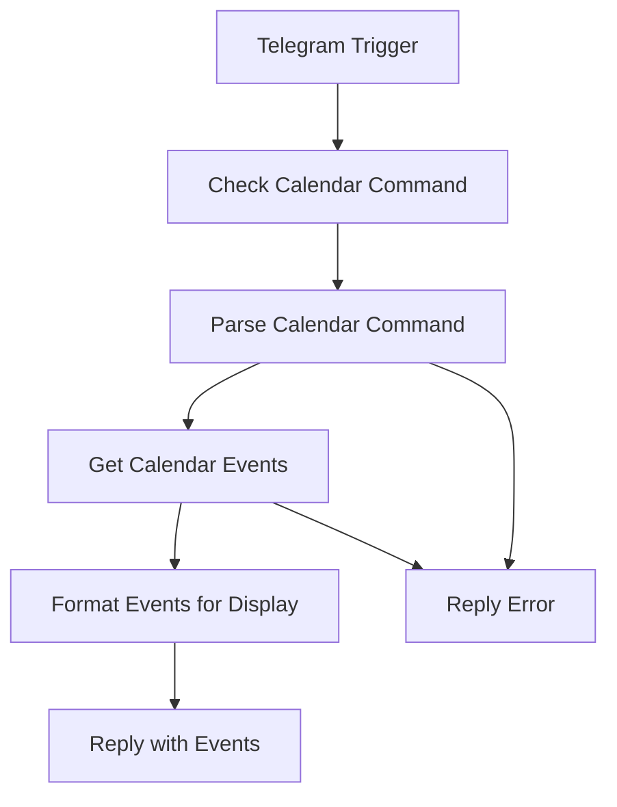

# Google Calendar API Integration - Home User Setup

## Overview

This integration provides Google Calendar functionality through Telegram Bot commands using n8n workflow automation. Perfect for single home user scenarios with simple event reading, creation, and management capabilities.

## Features

- **Read Calendar Events**: View events for today, this week, upcoming period, or custom date ranges
- **Flexible Time Views**: Today, week, upcoming (30 days), and custom date ranges
- **Rich Event Display**: Shows event details including time, location, description, and attendees
- **Telegram Interface**: Simple command-based interaction via chat
- **Security**: User ID authentication and input validation

## Prerequisites

1. **n8n Instance**: Running n8n automation platform
2. **Telegram Bot**: Bot token and chat setup
3. **Google Cloud Project**: With Google Calendar API enabled
4. **OAuth2 Credentials**: For Google API access

## Setup Instructions

### 1. Google Cloud Console Setup

```bash
# Enable Google Calendar API
1. Go to Google Cloud Console
2. Enable "Google Calendar API" 
3. Use existing OAuth2 credentials from Google Docs/Gmail setup
4. Ensure calendar scope is included: https://www.googleapis.com/auth/calendar
```

### 2. n8n Credential Configuration

```javascript
// Google OAuth2 API Credential in n8n (existing)
{
  "name": "Google APIs - Home User",
  "type": "googleOAuth2Api",
  "scopes": [
    "https://www.googleapis.com/auth/documents",
    "https://www.googleapis.com/auth/gmail.modify",
    "https://www.googleapis.com/auth/calendar"
  ],
  "clientId": "your-google-client-id",
  "clientSecret": "your-google-client-secret"
}
```

### 3. Import Workflow

1. Copy `workflows/telegram-to-google-calendar.json` content
2. Import into n8n via Settings > Import from clipboard
3. Update user ID in "Parse Calendar Command" node (line 12)
4. Activate the workflow

## Usage Commands

### View Today's Events
```
/calendar_today
```

### View This Week's Events  
```
/calendar_week
```

### View Upcoming Events (30 days)
```
/calendar_upcoming
```
or
```
/calendar_list
```

### Custom Date Range
```
/calendar_list 2024-01-15 to 2024-01-20
```

### Create Calendar Events
```
/create_event [Title] | [Date Time] | [Duration] | [Location] | [Description]
```

#### Event Creation Examples
```
# Full format with all details
/create_event Team Meeting | 2024-01-15 14:30 | 1 hour | Conference Room A | Weekly standup discussion

# Natural language dates
/create_event Quick Call | today 3pm | 30 minutes

# Tomorrow format
/create_event Doctor Appointment | tomorrow 2pm | 1 hour | Medical Center

# Minimal format (only title and date/time required)
/create_event Lunch Break | today 12pm
```

## Command Examples

### Typical Usage
```
/calendar_today
```
**Response:**
```
📅 Calendar Events (today)

📊 Found 3 events

1. **Team Standup**
   📅 01/15/2024
   🕐 09:00 AM - 09:30 AM
   📍 Conference Room A
   👥 5 attendees

2. **Project Review**
   📅 01/15/2024  
   🕐 02:00 PM - 03:00 PM
   📝 Review Q4 deliverables and timeline
   🔗 View in Calendar

3. **Dentist Appointment**
   📅 01/15/2024
   🕐 04:30 PM - 05:30 PM
   📍 Downtown Dental Office
```

### No Events Found
```
📅 No events found for today

🔍 Time range: 01/15/2024 - 01/15/2024

💡 Try /calendar_week or /calendar_upcoming for different views
```

## Security Features

### User Authentication
- Only specific Telegram user ID can execute commands
- Replace `ALLOWED_USER_ID = 123456789` with your Telegram user ID

### Input Validation
- Command format validation
- Date range verification
- Error handling for invalid inputs

### Privacy Controls
- Event descriptions truncated to 100 characters in display
- HTML links provided for full calendar access
- Attendee information shows count only (not names)

## Workflow Structure



## n8n Node Configuration

### Google Calendar Node (Get Events)
```javascript
{
  "operation": "getAll",
  "calendarId": "primary",
  "options": {
    "timeMin": "={{$json.startDate}}",
    "timeMax": "={{$json.endDate}}",
    "singleEvents": true,
    "orderBy": "startTime",
    "maxResults": 50
  }
}
```

### Command Parsing Logic
```javascript
// Supported time ranges:
// /calendar_today - Today's events (00:00 to 23:59)
// /calendar_week - Current week (Monday to Sunday)
// /calendar_upcoming - Next 30 days from now
// /calendar_list [date] to [date] - Custom range
```

### Event Formatting
- **Title**: Event summary with fallback to "Untitled Event"
- **Date/Time**: Localized formatting with all-day event detection
- **Location**: Displayed if available
- **Description**: Truncated to 100 characters with "..." if longer
- **Attendees**: Count only for privacy
- **Link**: Direct link to Google Calendar event

## Error Scenarios

### Common Errors
- **Invalid Date Format**: "Failed to parse date range"
- **Unauthorized User**: "Unauthorized user"
- **API Quota Exceeded**: "Google Calendar API quota exceeded"
- **No Calendar Access**: "Calendar not found or access denied"

### Troubleshooting
1. **Check Credentials**: Verify Google OAuth2 setup in n8n
2. **Verify User ID**: Ensure Telegram user ID is correct in workflow
3. **Test Permissions**: Confirm Google Calendar API is enabled
4. **Review Logs**: Check n8n execution logs for detailed errors

## Integration with Other Workflows

### Related Commands
- **Gmail**: `/send_email` - Email event details to attendees
- **Google Docs**: `/doc_create Title: Meeting Notes` - Create meeting documentation
- **Event Creation**: `/create_event` - Create new calendar events
- **Combined Usage**: View calendar, create events, create docs, send emails in sequence

### Workflow Chaining
```
1. /calendar_today
2. /create_event Follow-up Meeting | tomorrow 2pm | 1 hour | Based on today's discussion
3. /doc_create Title: Daily Standup Notes Body: Events from calendar
4. /send_email team@company.com Subject: Daily Schedule Body: See attached
```

## Customization Options

### Time Zone Configuration
- Update workflow settings timezone: "America/New_York"
- Modify date formatting in "Format Events for Display" node

### Extended Commands
- Add `/calendar_month` for monthly view
- Implement `/calendar_search [keyword]` for event search
- Add `/calendar_free` to find free time slots

### Display Enhancements
- Add emoji indicators for event types
- Implement color coding for different calendars
- Add weather integration for outdoor events

## Single Home User Benefits

✅ **Simple Setup**: Leverages existing Google API credentials  
✅ **Visual Workflows**: Easy to modify via n8n GUI  
✅ **Built-in Security**: OAuth2 and user authentication  
✅ **No Custom Code**: Uses n8n's native Google Calendar nodes  
✅ **Telegram Interface**: Familiar chat-based interaction  
✅ **Error Handling**: Built-in n8n error management  
✅ **Extensible**: Easy to add more calendar operations

This implementation provides a solid foundation for calendar management while maintaining the consistent n8n + Telegram Bot pattern established across all Google API integrations.