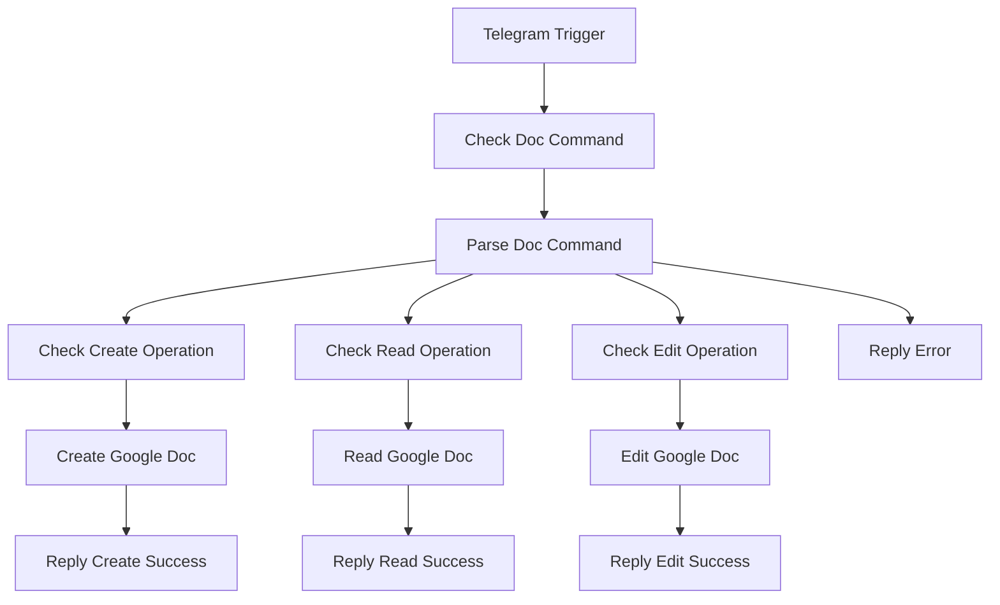

# Google Docs API Integration - Home User Setup

## Overview

This integration provides Google Docs functionality through Telegram Bot commands using n8n workflow automation. Perfect for single home user scenarios with simple document creation, reading, and editing capabilities.

## Features

- **Create Documents**: Create new Google Docs with title and content
- **Read Documents**: Retrieve document content by ID  
- **Edit Documents**: Update existing document content
- **Telegram Interface**: Simple command-based interaction
- **Security**: User ID authentication and input validation

## Prerequisites

1. **n8n Instance**: Running n8n automation platform
2. **Telegram Bot**: Bot token and chat setup
3. **Google Cloud Project**: With Google Docs API enabled
4. **OAuth2 Credentials**: For Google API access

## Setup Instructions

### 1. Google Cloud Console Setup

```bash
# Enable Google Docs API
1. Go to Google Cloud Console
2. Enable "Google Docs API" 
3. Create OAuth2 credentials
4. Add redirect URI: https://your-n8n-domain/rest/oauth2-credential/callback
```

### 2. n8n Credential Configuration

```javascript
// Google OAuth2 API Credential in n8n
{
  "name": "Google APIs - Home User",
  "type": "googleOAuth2Api",
  "scopes": [
    "https://www.googleapis.com/auth/documents",
    "https://www.googleapis.com/auth/drive.file"
  ],
  "clientId": "your-google-client-id",
  "clientSecret": "your-google-client-secret"
}
```

### 3. Telegram Bot Credential

```javascript
// Telegram API Credential in n8n
{
  "name": "Home Telegram Bot", 
  "type": "telegramApi",
  "accessToken": "your-bot-token"
}
```

### 4. Import Workflow

1. Copy `workflows/telegram-to-google-docs.json` content
2. Import into n8n via Settings > Import from clipboard
3. Update user ID in "Parse Doc Command" node (line 12)
4. Activate the workflow

## Usage Commands

### Create Document
```
/doc_create Title: Meeting Notes Body: Discussion about project timeline and deliverables
```

### Read Document  
```
/doc_read 1BxiMVs0XRA5nFMdKvBdBZjgmUUqptlbs74OgvE2upms
```

### Edit Document
```
/doc_edit 1BxiMVs0XRA5nFMdKvBdBZjgmUUqptlbs74OgvE2upms Body: Updated content with new information
```

## Security Features

### User Authentication
- Only specific Telegram user ID can execute commands
- Replace `ALLOWED_USER_ID = 123456789` with your Telegram user ID

### Input Validation
- Command format validation
- Document ID verification
- Content sanitization

### Error Handling
- Invalid command format detection
- Unauthorized user blocking
- Google API error management

## Workflow Structure



## n8n Node Configuration

### Google Docs Nodes

**Create Document Node:**
```javascript
{
  "operation": "create",
  "title": "={{$json.title}}",
  "content": "={{$json.content}}",
  "options": {
    "format": "text"
  }
}
```

**Read Document Node:**
```javascript
{
  "operation": "get",
  "documentId": "={{$json.documentId}}",
  "options": {
    "format": "text"
  }
}
```

**Update Document Node:**
```javascript
{
  "operation": "update", 
  "documentId": "={{$json.documentId}}",
  "updateFields": {
    "content": "={{$json.content}}"
  },
  "options": {
    "format": "text"
  }
}
```

## Error Scenarios

### Common Errors
- **Invalid Document ID**: "Document not found or access denied"
- **Unauthorized User**: "Unauthorized user" 
- **Invalid Format**: "Invalid format. Use: /doc_create Title: Your title Body: Your content"
- **API Quota Exceeded**: "Google API quota exceeded, try again later"

### Troubleshooting
1. **Check Credentials**: Verify Google OAuth2 setup in n8n
2. **Verify User ID**: Ensure Telegram user ID is correct in workflow
3. **Test Permissions**: Confirm Google Docs API is enabled
4. **Review Logs**: Check n8n execution logs for detailed errors

## Customization Options

### Extended Commands
- Add document sharing commands
- Implement document listing 
- Add formatting options (bold, italic, etc.)

### Enhanced Security
- Multi-user support with role-based access
- Command rate limiting
- Audit logging

### Integration Extensions
- Connect to Google Drive for file management
- Integration with calendar for meeting notes
- Backup automation to local storage

## Single Home User Benefits

✅ **Simple Setup**: No complex multi-tenant configuration  
✅ **Visual Workflows**: Easy to modify and extend via n8n GUI  
✅ **Built-in Security**: OAuth2 and user authentication  
✅ **No Custom Code**: Leverage n8n's native Google Docs nodes  
✅ **Telegram Interface**: Familiar chat-based interaction  
✅ **Error Handling**: Built-in n8n error management

This approach eliminates the need for custom Google Docs API implementations while providing a robust, secure document management system through simple Telegram commands.